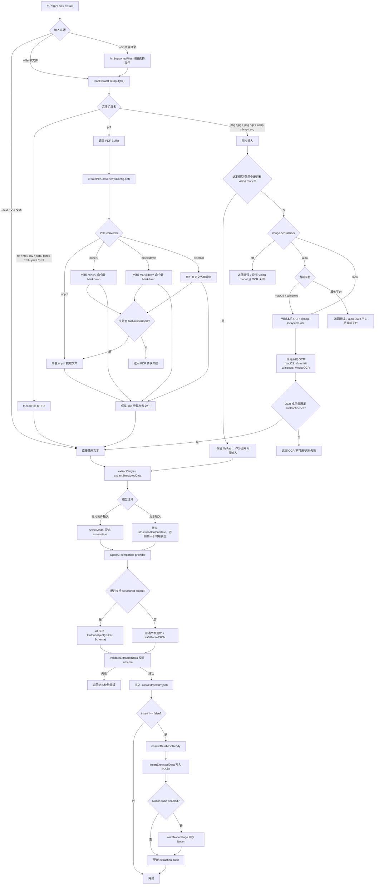

# 文件提取流程

```mermaid
flowchart TD
  A["用户运行 aiex extract"] --> B{"输入来源"}

  B -->|"--text / 交互文本"| T1["直接使用文本"]
  B -->|"--file 单文件"| F1["readExtractFileInput(file)"]
  B -->|"--dir 批量目录"| D1["listSupportedFiles 扫描支持文件"]
  D1 --> F1

  F1 --> F2{"文件扩展名"}

  F2 -->|"txt / md / csv / json / html / xml / yaml / yml"| TX1["fs.readFile UTF-8"]
  TX1 --> T1

  F2 -->|"pdf"| P1["读取 PDF Buffer"]
  P1 --> P2["createPdfConverter(aiConfig.pdf)"]
  P2 --> P3{"PDF converter"}
  P3 -->|"unpdf"| P4["内置 unpdf 提取文本"]
  P3 -->|"mineru"| P5["外部 mineru 命令转 Markdown"]
  P3 -->|"markitdown"| P6["外部 markitdown 命令转 Markdown"]
  P3 -->|"external"| P7["用户自定义外部命令"]
  P5 --> P8{"失败且 fallbackToUnpdf?"}
  P6 --> P8
  P7 --> P8
  P8 -->|"是"| P4
  P8 -->|"否"| ERR1["返回 PDF 转换失败"]
  P4 --> P9["保存 .md 旁路参考文件"]
  P5 --> P9
  P6 --> P9
  P7 --> P9
  P9 --> T1

  F2 -->|"png / jpg / jpeg / gif / webp / bmp / svg"| I0["图片输入"]
  I0 --> I1{"选定模型/配置中是否有 vision model?"}
  I1 -->|"是"| I2["保留 filePath，作为图片附件输入"]
  I1 -->|"否"| ICFG{"image.ocrFallback"}
  ICFG -->|"off"| ERR2A["返回错误：没有 vision model 且 OCR 关闭"]
  ICFG -->|"auto"| IPLAT{"当前平台"}
  ICFG -->|"local"| I3["强制本机 OCR: @napi-rs/system-ocr"]
  IPLAT -->|"macOS / Windows"| I3
  IPLAT -->|"其他平台"| ERR2B["返回错误：auto OCR 不支持当前平台"]
  I3 --> I3A["调用系统 OCR\nmacOS: VisionKit\nWindows: Media OCR"]
  I3A --> I4{"OCR 成功且满足 minConfidence?"}
  I4 -->|"是"| T1
  I4 -->|"否"| ERR2["返回 OCR 不可用/识别失败"]

  T1 --> E1["extractSingle / extractStructuredData"]
  I2 --> E1

  E1 --> M1{"模型选择"}
  M1 -->|"图片附件输入"| M2["selectModel 要求 vision=true"]
  M1 -->|"文本输入"| M3["优先 structuredOutput=true，否则第一个可用模型"]

  M2 --> A1["OpenAI-compatible provider"]
  M3 --> A1

  A1 --> A2{"是否支持 structured output?"}
  A2 -->|"是"| A3["AI SDK Output.object(JSON Schema)"]
  A2 -->|"否"| A4["普通文本生成 + safeParseJSON"]

  A3 --> V1["validateExtractedData 校验 schema"]
  A4 --> V1

  V1 -->|"失败"| ERR3["返回结构校验错误"]
  V1 -->|"成功"| O1["写入 .aiex/extracted/*.json"]

  O1 --> DB1{"insert !== false?"}
  DB1 -->|"否"| DONE["完成"]
  DB1 -->|"是"| DB2["ensureDatabaseReady"]
  DB2 --> DB3["insertExtractedData 写入 SQLite"]
  DB3 --> N1{"Notion sync enabled?"}
  N1 -->|"否"| AUDIT["更新 extraction audit"]
  N1 -->|"是"| N2["writeNotionPage 同步 Notion"]
  N2 --> AUDIT
  AUDIT --> DONE
```
