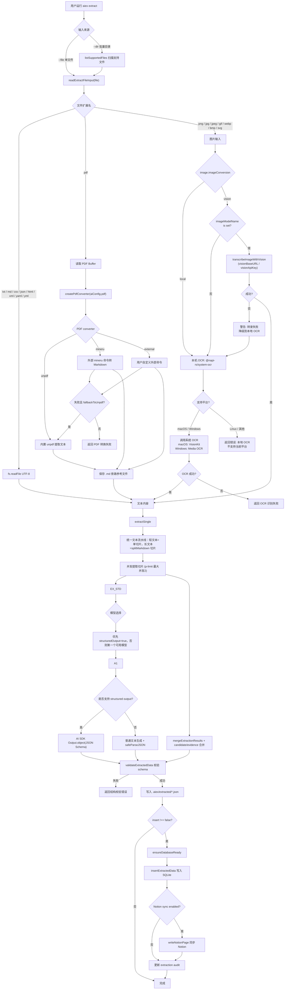

# Flow Chart

```mermaid
flowchart TD
  A["用户运行 aiex extract"] --> B{"输入来源"}

  B -->|"--file 单文件"| F1["readExtractFileInput(file)"]
  B -->|"--dir 批量目录"| D1["listSupportedFiles 扫描支持文件"]
  D1 --> F1

  F1 --> F2{"文件扩展名"}

  F2 -->|"txt / md / csv / json / html / xml / yaml / yml"| TX1["fs.readFile UTF-8"]
  TX1 --> T1["文本内容"]

  F2 -->|"pdf"| P1["读取 PDF Buffer"]
  P1 --> P2["createPdfConverter(aiConfig.pdf)"]
  P2 --> P3{"PDF converter"}
  P3 -->|"unpdf"| P4["内置 unpdf 提取文本"]
  P3 -->|"mineru"| P5["外部 mineru 命令转 Markdown"]
  P3 -->|"external"| P7["用户自定义外部命令"]
  P5 --> P8{"失败且 fallbackToUnpdf?"}
  P7 --> P8
  P8 -->|"是"| P4
  P8 -->|"否"| ERR1["返回 PDF 转换失败"]
  P4 --> P9["保存 .md 旁路参考文件"]
  P5 --> P9
  P7 --> P9
  P9 --> T1

  F2 -->|"png / jpg / jpeg / gif / webp / bmp / svg"| I0["图片输入"]
  I0 --> ICFG{"image.imageConversion"}
  ICFG -->|"local"| I3["本机 OCR: @napi-rs/system-ocr"]
  ICFG -->|"vision"| IV1{"imageModelName\nis set?"}
  IV1 -->|"否"| I3
  IV1 -->|"是"| IV2["transcribeImageWithVision\n(visionBaseURL / visionApiKey)"]
  IV2 --> IV3{"成功?"}
  IV3 -->|"否"| IW["警告: 转录失败\n降级到本地 OCR"]
  IW --> I3
  I3 --> I_PLAT{"支持平台?"}
  I_PLAT -->|"macOS / Windows"| I3A["调用系统 OCR\nmacOS: VisionKit\nWindows: Media OCR"]
  I_PLAT -->|"Linux / 其他"| ERR2B["返回错误: 本地 OCR\n不支持当前平台"]
  I3A --> I4{"OCR 成功?"}
  I4 -->|"是"| T1
  I4 -->|"否"| ERR2["返回 OCR 识别失败"]
  IV3 -->|"是"| T1

  T1 --> E1["extractSingle"]

  E1 --> CK1["统一文本流水线：短文本=单切片，长文本=splitMarkdown 切片"]

  CK1 --> CK_LOOP["并发提取切片 (p-limit 最大并发2)"]
  CK_LOOP --> EX_STD
  CK_LOOP --> CK_MERGE["mergeExtractionResults + candidate/evidence 合并"]
  CK_MERGE --> V1["validateExtractedData 校验 schema"]

  EX_STD --> M1{"模型选择"}
  M1 --> M3["优先 structuredOutput=true，否则第一个可用模型"]

  M3 --> A1

  A1 --> A2{"是否支持 structured output?"}
  A2 -->|"是"| A3["AI SDK Output.object(JSON Schema)"]
  A2 -->|"否"| A4["普通文本生成 + safeParseJSON"]

  A3 --> V1
  A4 --> V1

  V1 -->|"失败"| ERR3["返回结构校验错误"]
  V1 -->|"成功"| O1["写入 .aiex/extracted/*.json"]

  O1 --> DB1{"insert !== false?"}
  DB1 -->|"否"| DONE["完成"]
  DB1 -->|"是"| DB2["ensureDatabaseReady"]
  DB2 --> DB3["insertExtractedData 写入 SQLite"]
  DB3 --> N1{"Notion sync enabled?"}
  N1 -->|"否"| AUDIT["更新 extraction audit"]
  N1 -->|"是"| N2["writeNotionPage 同步 Notion"]
  N2 --> AUDIT
  AUDIT --> DONE
```
