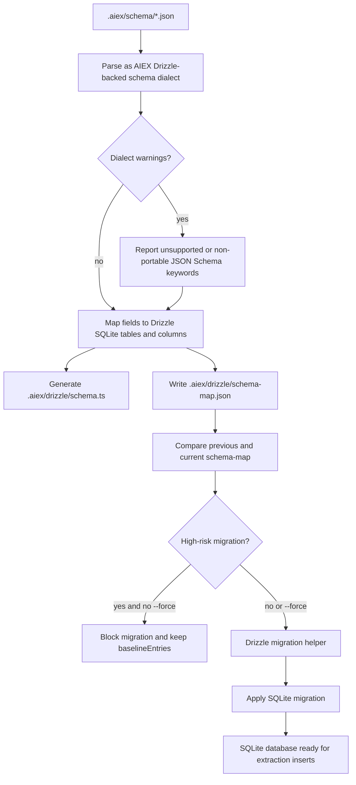
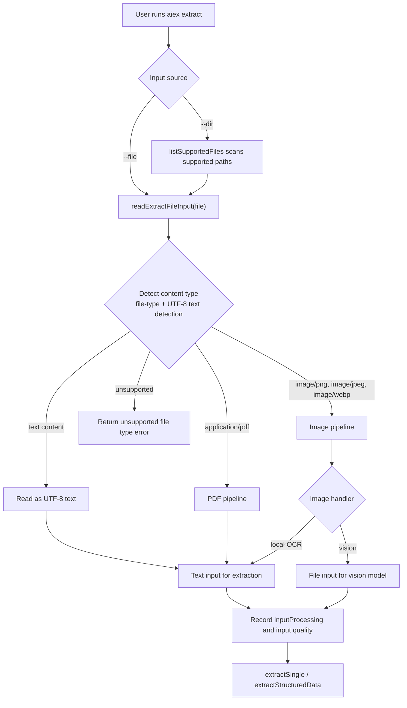
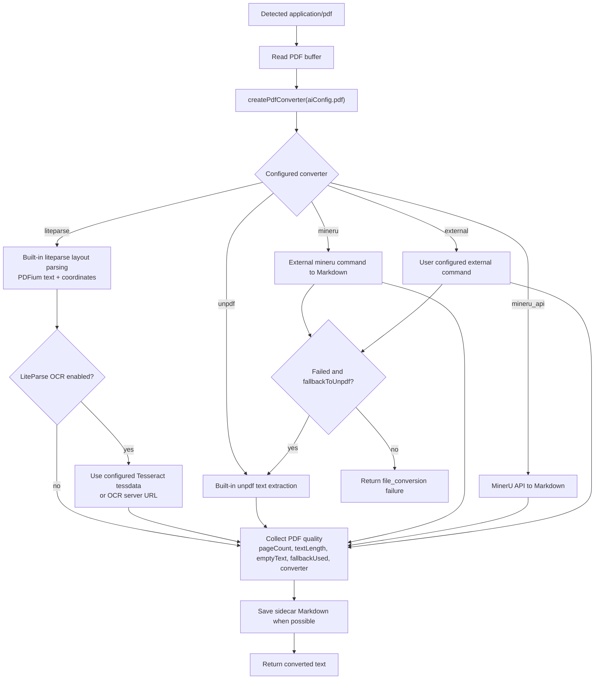
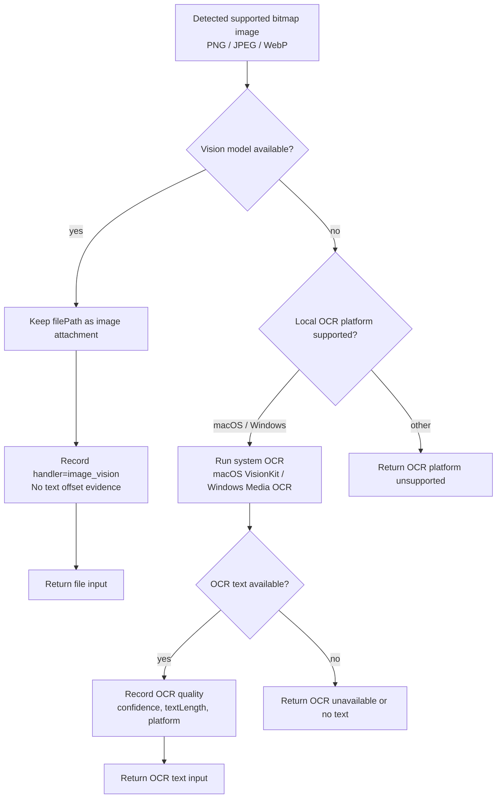
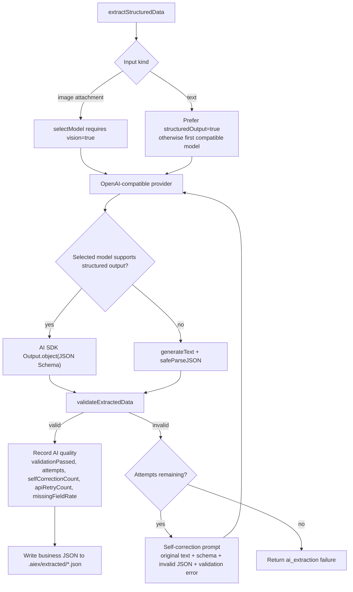
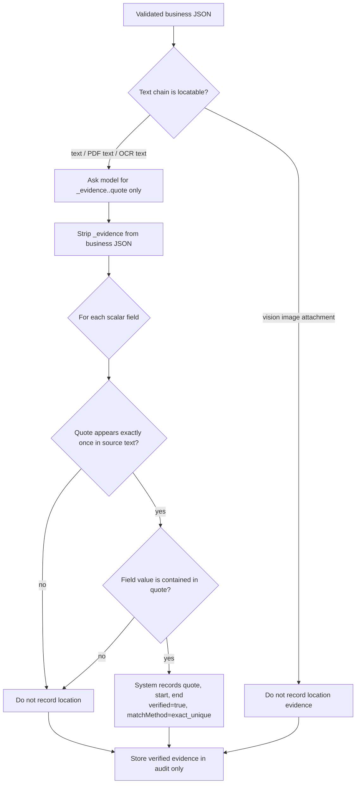
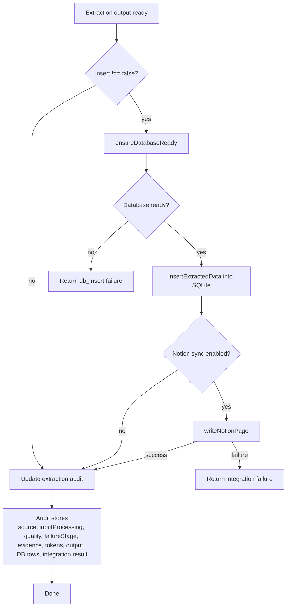

# Extraction Flow Charts

This document splits the extraction pipeline into smaller diagrams so each stage can be read independently.

## 0. Schema To SQLite Pipeline

## 1. Entry And File Routing

## 2. PDF Conversion Pipeline

## 3. Image Pipeline

## 4. AI Extraction And Validation

## 5. Evidence Location Rules

## 6. Persistence, Integrations, And Audit

